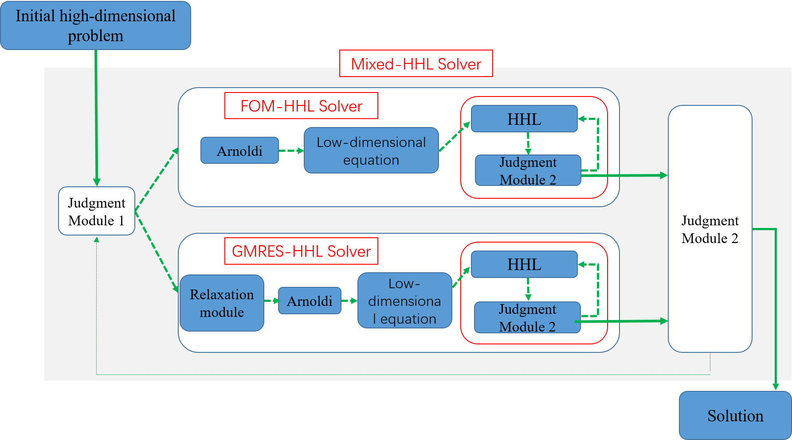

The Mixed-HHL Solver
=====================
The Mixed-HHL solver does not directly use quantum algorithm to solve the original system of equations, but first uses the "Krylov subspace" method to reduce the dimension of the original linear space and then uses the HHL algorithm to solve the problem. Since the Full Orthogonalization Method(FOM) belongs to the orthogonal projection method, the solution stability existence requires A to be positive definite, and this condition is often not satisfied in practical computations. For the oblique projection methods such as Generalized Minimum Residual（GMRES), the requirement that matrix A is non-singular is easy to be satisfied, so the GMRES method has very high stability in practical calculation. However, the convergence speed of GMRES method is much slower than that of FOM method.Combining the advantages of the two methods, a Mixed-HHL linear solution algorithm is proposed.

Algorithm target
>>>>>>>>>>
----

Solve the problems of unstable solution and slow convergence when FOM method and GMRES method are used separately, and accelerate the solution speed of HHL algorithm.

Algorithm overview
>>>>>>>>>>
----

The overall calculation process of the mixed-HHL solver is shown in the figure below.

First, the solver is provided with A system of linear equations containing the coefficient matrix A and vector b.When calling the mixed-hhl solver, we first need to give an initial solution.The selection of the initial solution is arbitrary in principle, and 0 is generally adopted as the initial solution.

#. The initial residual goes into the judgment module 1 as input, which is used to decide whether the mixed-HHL solver chooses the fom or gmres kernel. In the kernel module, the first part is the MGS-Arnoldi algorithm. The function of the algorithm is to receive the coefficient matrix A and the residual b, and output the orthonormal basis of the Krylov subspace composed of A and b and the corresponding Hessenberg matrix, that is, the low-dimensional equation system, and then input to the second module.
#. The second module is the iterative hhl algorithm module, whose function is to solve the low-dimensional system of equations obtained in the previous step. Considering the accuracy loss of the hhl algorithm, the iterative function is added to improve the accuracy of the HHL solution. Judgment module 2 is used to judge whether the residual of the solution obtained by the HHL algorithm meets the corresponding accuracy requirements. If not, the iterative solution is continued. If it does, the low-dimensional solution is restored to high-dimensional and the FOM/GMRES solution kernel is exited and the judgment module 3 is entered.
#. The function of judgment module 3 is to detect whether the residual error of the high-dimensional solution output by the FOM/GMRES kernel meets the accuracy requirement or whether the number of kernel iterations exceeds the maximum number of allowed iterations. If it is false, it returns to judgment module 1 for iteration.

    The principle of HHL algorithm will not be repeated here.

Interface introduction
>>>>>>>>>>
----

Mixed-HHL solver designed ``iter_ sparse_ mixed_ subspace_ The solver`` interface is used to calculate the solution of a linear system. This interface requires seven parameters. The specific parameters are described as follows

    .. code-block:: C++

        std::vector<double> iter_sparse_mixed_subspace_solver(const std::vector<vector<pair<double, size_t>>>& s_jacobian, std::vector<double>& b, int maxdim, int pre, int shiftvectormode, int iter_Kyrlov_subspace_step, double  iter_Kyrlov_subspace_pre);
            **Parameters:**
            /**
            * @brief iter_mixed_subspace_hhl solver code
            * @param[in] s_jacobian: matrix A of Ax = b
            * @param[in] b: vector b of Ax=b
            * @param[in] maxdim: max dimension of Kyrlov subspace
            * @param[in] pre: precision of single iterative HHL solver
            * @param[in] shiftvectormode: decide shiftvector format((0) 1 is (not) turn on the dynamic relaxation module)
            * @param[in] iter_Kyrlov_subspace_step：maximum number of iterations of Kyrlov subspace method
            * @param[in] iter_Kyrlov_subspace_pre: calculation accuracy of Kyrlov subspace method
            **/ 

Examples
>>>>>>>>>>
----

  .. code-block:: C++

        #include "QSolver/include/Qsolver.h"
        typedef Eigen::MatrixXd mat;
        typedef Eigen::VectorXd vec;
        using namespace std;

        int main()
        {
            size_t dimension = 4;
            mat jacobian = mat::Zero(dimension, dimension);
            std::vector<double> b(dimension);
            for (int i = 0; i < dimension; ++i)
            {
                jacobian(i, i) = pow(i, 2) + 1.0;
                if (i < dimension - 1) jacobian(i, i + 1) = i * 1.0;
                b[i] = 1.0;
            }
            cout<<"The input matrix is"<<endl;
            cout << jacobian << endl;
            std::vector<vector<pair<double, size_t>>> s_jacobian;
            s_jacobian.resize(dimension);
            for (int i = 0; i < dimension; i++)
            {
                for (int j = 0; j < dimension; j++)
                {
                    double value = jacobian(i, j);
                    if (value != 0)
                    {
                        s_jacobian[i].push_back(make_pair(value, j));
                    }
                }
            }
            vector<double> x(dimension, 0);
            int maxdim=2;
            int pre= 1e-8;
            int shiftvectormode = 1;
            int iter_Kyrlov_subspace_step = 20000;
            double iter_Kyrlov_subspace_pre = 1e-8;
            x = iter_sparse_mixed_subspace_solver(s_jacobian, b, maxdim, pre,shiftvectormode, iter_Kyrlov_subspace_step, iter_Kyrlov_subspace_pre);
            cout<<"The solution for a linear system is"<<endl;
            for (size_t i = 0; i <x.size(); i++)
            { 
                cout << x[i] << endl;
            }	
        }

This example produces the following result:

    .. code-block:: C++

        The input matrix is
        1  0  0  0
        0  2  1  0
        0  0  5  2
        0  0  0 10
        The solution for a linear system is
        1
        0.42
        0.16
        0.1